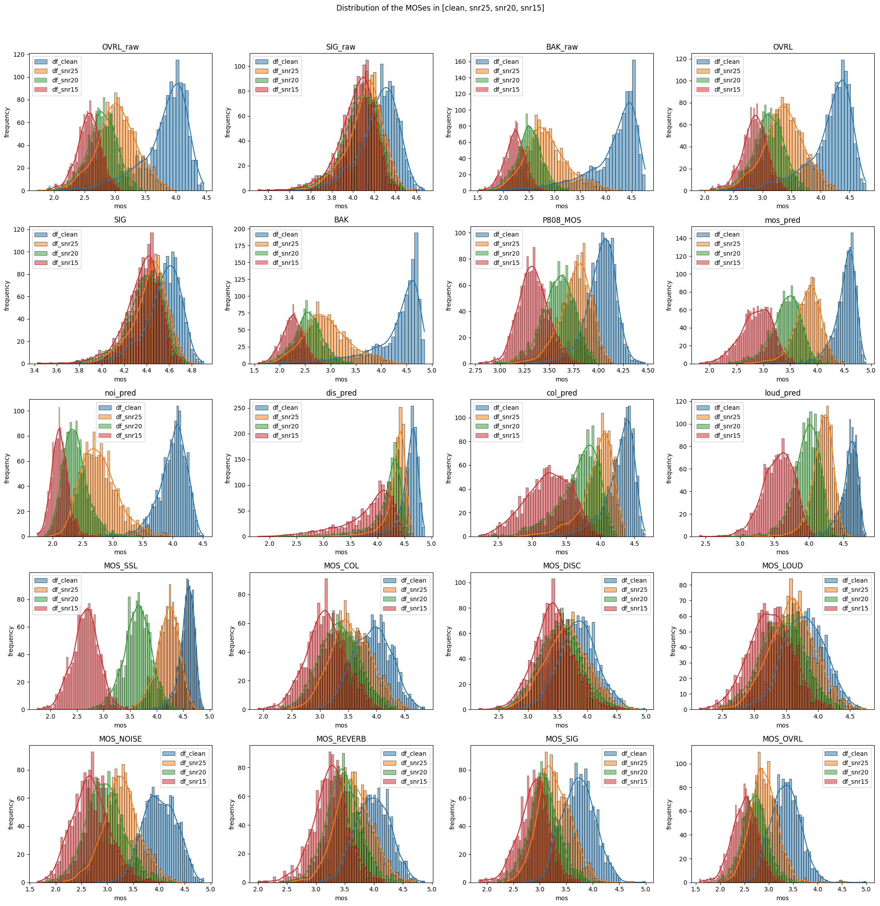
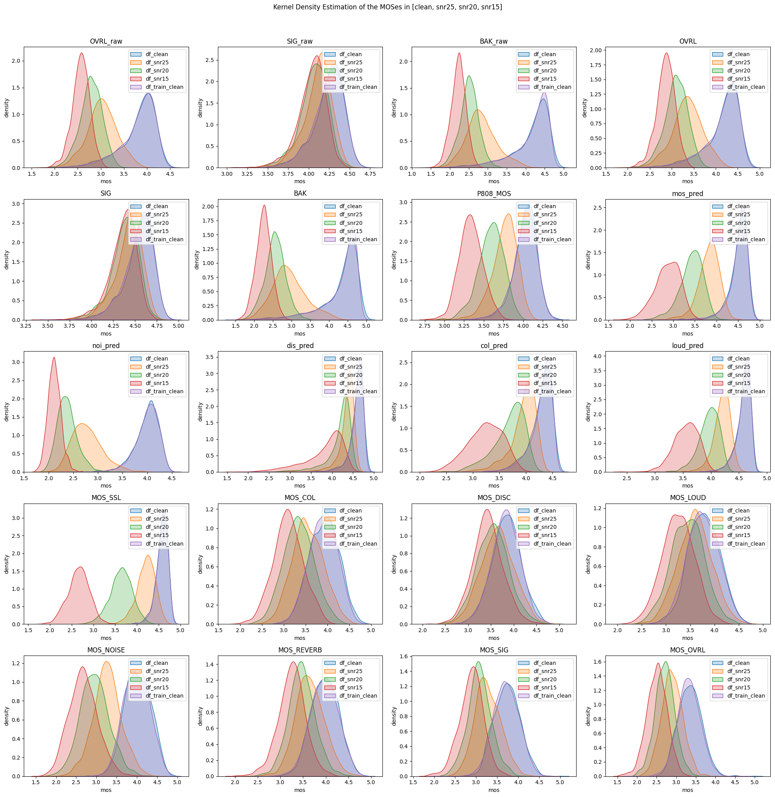

# MOS

This MOS (Mean Opinion Score) system integrates components from various sources:

1. DNSMOS (https://github.com/microsoft/DNS-Challenge/tree/master/DNSMOS): 7 scores
2. NISQA (https://github.com/gabrielmittag/NISQA): 5 scores
3. MOSSSL (https://github.com/nii-yamagishilab/mos-finetune-ssl): 1 score
4. SIGMOS (https://github.com/microsoft/SIG-Challenge/tree/main/ICASSP2024/sigmos): 7 scores

For each audio file, the system utilizes the librosa library to read it as a waveform.
Subsequently, it performs inference for four MOS metrics, generating 20 scores in total, and then saves the results in a CSV file.

Note that MOSSSL is optimized for GPU acceleration, ensuring significantly faster performance.

## Setting up the Environment

1. Create a conda environment:

```
conda create -n mos python=3.10
```

2. Activate the conda environment:

```
conda activate mos
```

3. Install required packages:

```
pip install pandas seaborn librosa onnxruntime-gpu fairseq tensorboardX
```

or

```
conda install --file requirement.txt
```

## Running Inference

1. Update inference directory at `MOS/wav_to_csv.py`, `wavdir`.

2. Execute inference:

```
cd MOS
python wav_to_csv.py
```

## Result

If you wish to visualize the distribution, please execute the `csv_distribution.ipynb` notebook.

For the different train/test audio files:

- 1310 clean audio
- 1310 SNR_25 audio
- 1310 SNR_20 audio
- 1310 SNR_15 audio
- 11790 clean audio

  from LJSpeech, we applied various levels of noise at different SNR (Signal-to-Noise Ratio) levels.

The distribution of Mean Opinion Scores for these batches of audio files, is depicted in the chart through histplot and kdeplot.


